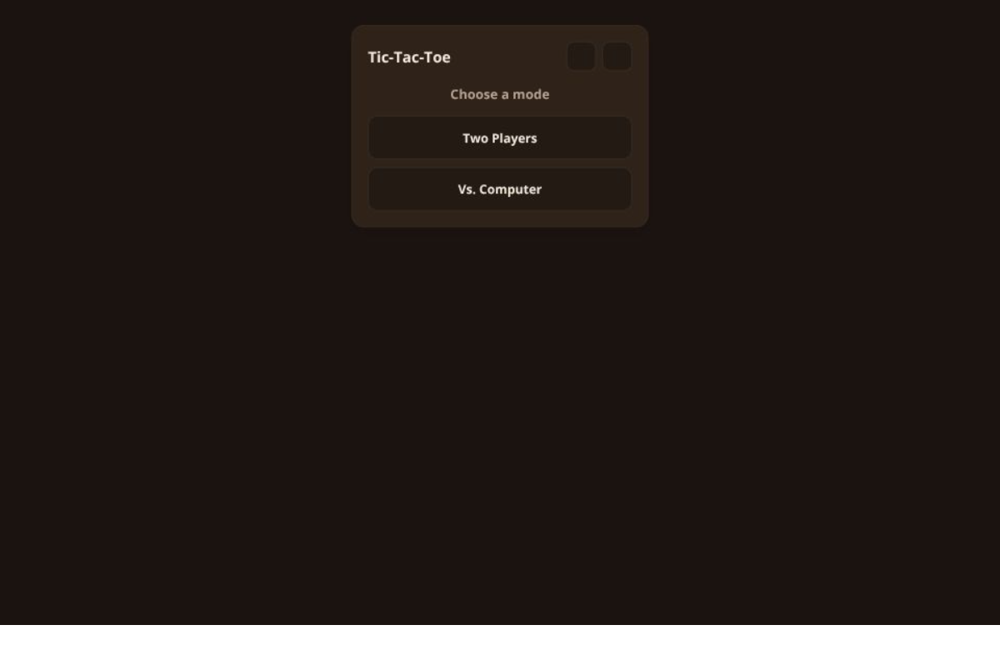
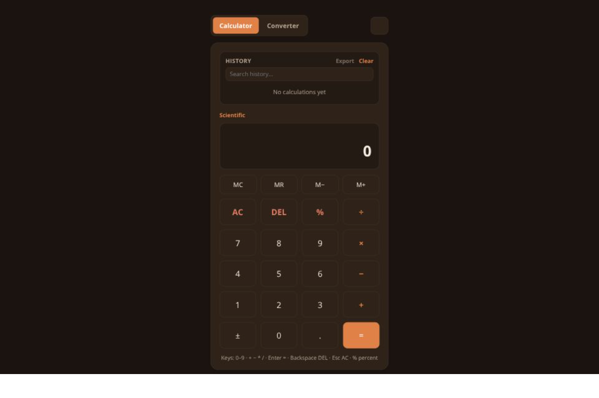
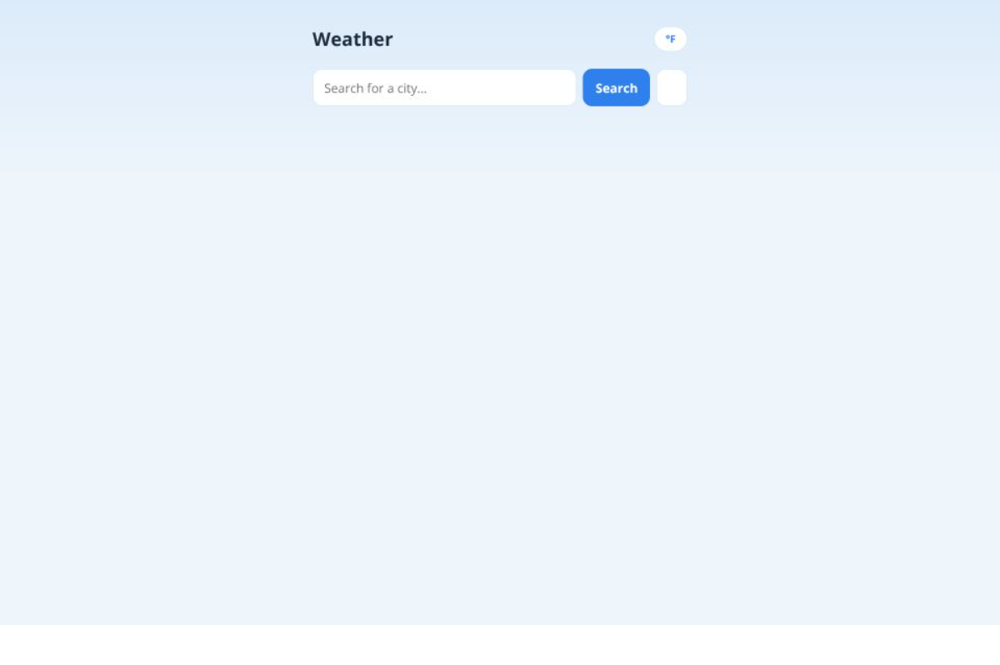

# Jacquez Monroe — Portfolio (Vol. 2)

A multi-page personal portfolio for Jacquez Monroe, web developer. Plain HTML, CSS, and JavaScript — no framework, no build step.

This is a second, separate version of an existing portfolio: the first was a warm, minimal single-page site; this one is a full multi-page build with its own "futuristic" design system.

## Live site

**[my-website-vol-2.vercel.app](https://my-website-vol-2.vercel.app)**

## The journey

**1. The brief.** The starting point was a design brief for a "pure futuristic" portfolio: navy/near-black backgrounds, electric blue for structure, and yellow reserved as a single signal color — never decorative, only for primary CTAs, the active nav item, and featured tags. Multi-page, not a single scroller: home, about, projects, contact, plus a dedicated detail page per project.

**2. Design system first.** Before any page markup, the CSS variables, type stack (Space Grotesk for headings, IBM Plex Mono for nav/data, system sans for body), and the signature details went in first — the dot-grid hero background, HUD-style corner brackets, the one-time scan-line sweep on primary-button hover, the pulsing status dot, and the sticky/blurred header. Building the system before the pages meant every page after this point was just assembly.

**3. Shared behavior.** One `script.js` handles everything every page needs: the first-visit boot splash (typed line by line, `sessionStorage`-gated so it doesn't replay on navigation), the live header clock, active-nav highlighting, the mobile hamburger menu, and the ~200ms page-fade on internal link clicks.

**4. The pages.** Home, about, projects, and contact went in next, followed by the three project detail pages (Tic-Tac-Toe, Calculator, Weather App) — each with an overview, a real technical challenge and how it was approached, a feature list, and a sidebar with the tech stack and links.

**5. Shipping it.** The repo went up on GitHub with the build broken into logical commits (scaffold → design system → behavior → each page → each project detail page), then connected to Vercel for auto-deploy on every push to `main`.

**6. Real content.** The initial build used a placeholder resume PDF and `[ preview ]` boxes where screenshots would go — deliberately, so they'd be easy to swap out. Once the real resume and actual app screenshots (Tic-Tac-Toe, Calculator, Weather App) were ready, they replaced the placeholders in the same commit-per-change pattern.

The full history of that progression — every step above as its own commit — is in this repo's [commit log](../../commits/main).

## Preview

| | | |
|---|---|---|
|  |  |  |
| Tic-Tac-Toe (React) | Calculator | Weather App |

## Design system

- **Colors** — deep navy background (`#0A0E17`), panel background (`#111827`), electric blue (`#2E86FF`) for structure/nav/links, and yellow (`#F5C518`) reserved as a single signal color for primary CTAs, the active nav item, and featured tags.
- **Type** — Space Grotesk for headings, IBM Plex Mono for nav/labels/data, system sans-serif for body copy.
- **Signature details** — a faint dot-grid pattern behind hero sections, HUD-style corner brackets on project cards/previews, a one-time scan-line sweep on primary button hover, a live local-time readout in the header, and a terminal-style status line in the footer.
- **Boot sequence** — a full-screen splash types out a short "system check" sequence on first visit per session (`sessionStorage`-gated), then fades out.

All of the above respects `prefers-reduced-motion` and includes visible keyboard focus states.

## Structure

```
index.html              Home — hero + featured project cards
about.html               About — bio + skill tags
projects.html             Projects — all three builds as full cards
contact.html              Contact — mailto link
projects/
  tic-tac-toe.html         Project detail — React + Vite tic-tac-toe
  calculator.html          Project detail — scientific calculator PWA
  weather.html             Project detail — weather app
css/style.css            Shared design system and layout
js/script.js              Shared behavior: splash sequence, header clock,
                           active-nav highlighting, mobile menu, page-fade
                           transitions
assets/resume.pdf         Downloadable resume
assets/previews/          Real screenshots used on project cards/details
```

Every page shares the same sticky header (logo, nav, live clock, mobile hamburger) and footer (copyright + status line), duplicated per page since there's no build tool to share partials.

## Running locally

No build step — just serve the folder statically, e.g.:

```bash
python3 -m http.server 4173
```

Then open `http://localhost:4173`.

## Deploying

This is static output, so it deploys as-is to Vercel, Netlify, GitHub Pages, or any static host. This project is deployed on Vercel, connected directly to this GitHub repo — every push to `main` auto-deploys.
